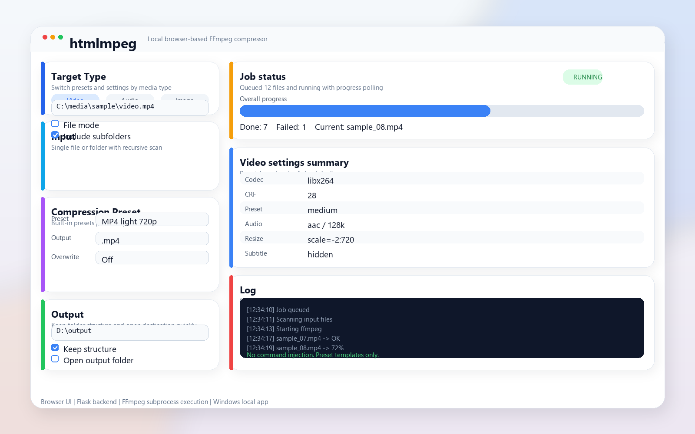

# htmlmpeg

Local FFmpeg compressor for video, audio, and image files.



## Purpose

FFmpeg is powerful, but its command-line workflow is often too technical for everyday use. This project packages common compression tasks into a browser-based, preset-driven workflow for local use on Windows.

## Quick Start

1. Open the GitHub release page and download an asset.
2. Use `ブラウザFFMPEG.zip` if you want the packaged version, or `ブラウザFFMPEG.exe` directly.
3. Extract the zip if needed.
4. Choose a media type, select a preset, and start compression.

This project provides:

- a browser-based UI
- a Python backend
- FFmpeg/FFprobe subprocess execution
- preset-based compression workflows

## Run

1. Install Python dependencies from `requirements.txt`
2. Make sure `ffmpeg.exe` and `ffprobe.exe` are available
3. Start the app with `start.ps1` or `python app.py`

## Notes

- Built-in presets live in `presets/`
- User presets and runtime logs are treated as local data
- `temp/`, `dist/`, `build/`, and generated logs are not tracked

## EXE Release

The repository includes a GitHub Actions workflow that builds the Windows EXE and publishes it as a release asset when a `release/**` branch is pushed.

Current release branch:

- `release/exe-latest`

Download from:

- https://github.com/ponta0365/htmlmpeg/releases/tag/exe-latest

Published assets:

- `ブラウザFFMPEG.exe`
- `ブラウザFFMPEG.zip`

How to use the release:

1. Open the release page
2. Download `ブラウザFFMPEG.zip` if you want the packaged file, or `ブラウザFFMPEG.exe` directly
3. Extract the zip if needed
4. Run the EXE on Windows

To rebuild locally, run:

```powershell
.\build_exe.ps1
```

To publish a GitHub Release with `gh`, run:

```powershell
.\publish_release.ps1
```

## Acknowledgments

This project uses FFmpeg and related libraries and tools provided by their respective authors and maintainers. I would like to express my gratitude to everyone who created and maintains the libraries and packaging tools used here.

This application was developed with the assistance of AI. The source code, release workflow, and publication process were prepared and published with AI support, and this is disclosed here transparently to avoid misunderstanding about how it was created.
